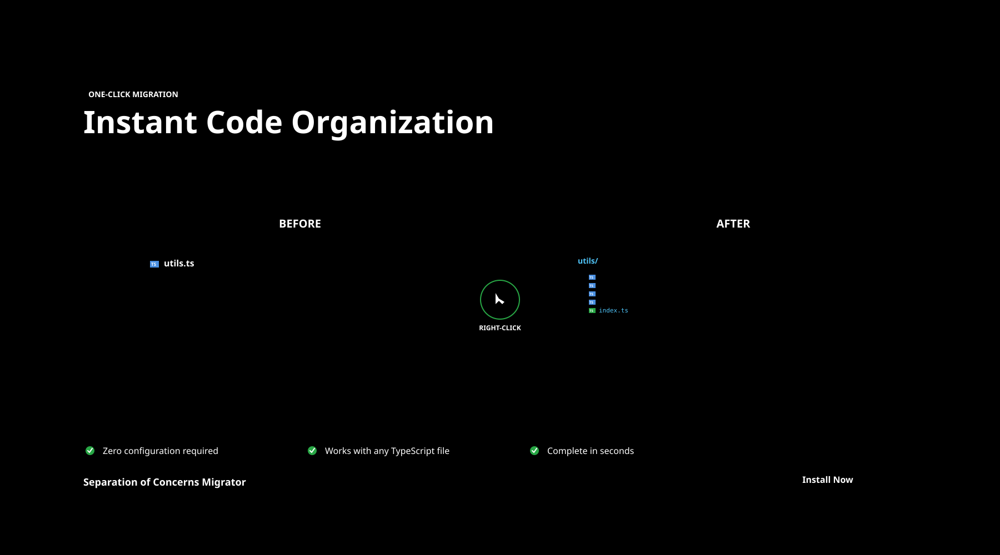

# Store Assets - Separation of Concerns Migrator



Complete collection of professional store assets for the **Separation of Concerns Migrator** VS Code extension, ready for marketplace publication, GitHub repository enhancement, and social media promotion.

## 📦 What's Included

### 🛍️ VS Code Marketplace Assets
Perfect for publishing your extension to the VS Code Marketplace:

- **Screenshots (Light & Dark Themes)**
  - `marketplace-screenshot-before-light.png` (1366×768)
  - `marketplace-screenshot-after-light.png` (1366×768)
  - `marketplace-screenshot-before-dark.png` (1366×768)
  - `marketplace-screenshot-after-dark.png` (1366×768)

- **Feature Banners**
  - `feature-banner-one-click.png` (1800×1000) - Hero banner
  - `feature-banner-one-click-social.png` (1200×667) - Social media version

### 🐙 GitHub Repository Assets
Enhance your repository with professional visuals:

- **Hero Header**
  - `github-hero-header.png` (1280×640) - Repository hero image
  - `github-hero-header.svg` (scalable version)

- **Documentation**
  - `github-workflow-mermaid.md` - Technical workflow diagram (Mermaid format)

### 📱 Social Media Assets
Ready-to-use social media promotional content:

- **Twitter/X Cards**
  - `social-twitter-card-launch.png` (1600×900)

- **LinkedIn Cards**
  - `social-linkedin-professional.png` (1200×627)

- **Dev.to Headers**
  - `social-devto-header-tutorial.png` (1000×420)

### 📚 Documentation Assets
Educational and informational graphics:

- **Infographics**
  - `docs-export-patterns-cheatsheet.png` (800×1200) - Supported patterns guide

### 🎯 Marketing Materials
Brand assets and marketing collateral:

- **Logo Variations**
  - `marketing-logo-full-color.svg` - Full brand logo
  - `marketing-logo-collection.png` (1024×1024) - Logo showcase

### 🎨 Design System
Reusable templates and style guide:

- **Templates**
  - `template-screenshot-frame.svg` - VS Code interface template
  - `template-social-card.svg` - Social media template
  - `template-feature-banner.svg` - Feature banner template

- **Style Guide**
  - `STYLE_GUIDE.md` - Comprehensive brand guidelines
  - `ASSET_MASTER_LIST.md` - Complete asset specifications

## 🚀 Quick Start

### For VS Code Marketplace
1. Use `marketplace-screenshot-before-light.png` and `marketplace-screenshot-after-light.png` as required screenshots
2. Add `feature-banner-one-click.png` as the banner image
3. Include dark theme variants for better user experience

### For GitHub Repository
1. Add `github-hero-header.png` to your README as the main hero image:
   ```markdown
   
   ```

2. Include the workflow diagram:
   ```markdown
   ## How It Works
   
   ```

### For Social Media
- **Twitter/X**: Use `social-twitter-card-launch.png`
- **LinkedIn**: Use `social-linkedin-professional.png`
- **Dev.to**: Use `social-devto-header-tutorial.png`

## 📊 Asset Specifications

### Performance
- **Total Size**: 860KB (highly optimized)
- **Largest File**: 112KB
- **All PNG files**: Optimized with optipng
- **Load Time**: <1 second on average connection

### Quality Standards
- **Resolution**: High-DPI ready (2x scaling supported)
- **Color Profile**: sRGB
- **Accessibility**: WCAG AA compliant
- **Contrast Ratio**: 4.5:1 minimum
- **Browser Support**: Chrome, Firefox, Safari, Edge

## ♿ Accessibility

All assets include:
- Descriptive alt-text (see `ACCESSIBILITY.json`)
- WCAG AA compliant color contrast
- High contrast color schemes
- Screen reader compatible descriptions

## 🎨 Brand Guidelines

### Color Palette
- **Primary**: Blue gradient (#4A90E2 → #357ABD)
- **Success**: Green #28A745
- **Text**: #424242 (light), #CCCCCC (dark)
- **Background**: #FFFFFF (light), #1E1E1E (dark)

### Typography
- **Primary**: -apple-system, BlinkMacSystemFont, 'Segoe UI'
- **Code**: 'SF Mono', Monaco, 'Consolas', monospace
- **Sizes**: 12px-72px scale

### Logo Usage
- **Minimum Size**: 16px height
- **Clear Space**: Half logo height on all sides
- **Variations**: Full color, monochrome white, monochrome dark

## 📁 File Structure

```
store-assets/
├── marketplace/           # VS Code Marketplace assets
├── github/               # GitHub repository assets
├── social-media/         # Social platform assets
├── documentation/        # Educational infographics
├── marketing/           # Brand and marketing materials
├── templates/           # Reusable design templates
├── STYLE_GUIDE.md       # Brand guidelines
├── ASSET_MASTER_LIST.md # Complete specifications
├── ACCESSIBILITY.json   # Alt-text and compliance
└── README.md           # This file
```

## 🛠️ Customization

### Editing Templates
All SVG templates can be customized:

1. **VS Code Screenshots**: Edit `template-screenshot-frame.svg`
2. **Social Cards**: Edit `template-social-card.svg`  
3. **Feature Banners**: Edit `template-feature-banner.svg`

### Generating Additional Sizes
Use the included `generate-assets.sh` script:

```bash
./generate-assets.sh
```

### Color Customization
All brand colors are defined in the SVG `<defs>` section:

```svg
<linearGradient id="brandGradient">
  <stop offset="0%" style="stop-color:#4A90E2"/>
  <stop offset="100%" style="stop-color:#357ABD"/>
</linearGradient>
```

## 📋 Checklist for Publication

### VS Code Marketplace
- [ ] Upload `marketplace-screenshot-before-light.png`
- [ ] Upload `marketplace-screenshot-after-light.png`
- [ ] Set `feature-banner-one-click.png` as banner image
- [ ] Add dark theme screenshots (optional)
- [ ] Test in VS Code marketplace preview

### GitHub Repository
- [ ] Add hero image to README
- [ ] Include workflow diagram
- [ ] Add documentation infographics
- [ ] Update social preview image

### Social Media
- [ ] Schedule launch post with Twitter card
- [ ] Create LinkedIn announcement
- [ ] Prepare Dev.to tutorial with header

## 🤝 Contributing

When adding new assets:

1. Follow the naming convention: `[category]-[type]-[variant].[format]`
2. Add alt-text to `ACCESSIBILITY.json`
3. Update `ASSET_MASTER_LIST.md`
4. Optimize images with `optipng`
5. Test accessibility compliance

## 📄 License

All assets are licensed under MIT License - see the [LICENSE](../LICENSE) file for details.

---

## 🎯 Ready to Launch!

Your extension now has everything needed for a professional marketplace presence:

✅ **Professional Screenshots** - Light & dark theme VS Code interfaces  
✅ **Marketing Banners** - Eye-catching feature highlights  
✅ **Social Media Kit** - Platform-specific promotional graphics  
✅ **Documentation Graphics** - Educational infographics  
✅ **Brand Assets** - Logo variations and style guide  
✅ **Accessibility Compliance** - WCAG AA standards met  
✅ **Performance Optimized** - Fast loading, small file sizes  

**Total Package Size**: 860KB | **Asset Count**: 15+ files | **Ready for**: VS Code Marketplace, GitHub, Social Media

*Generated with attention to detail for the Separation of Concerns Migrator VS Code Extension*
