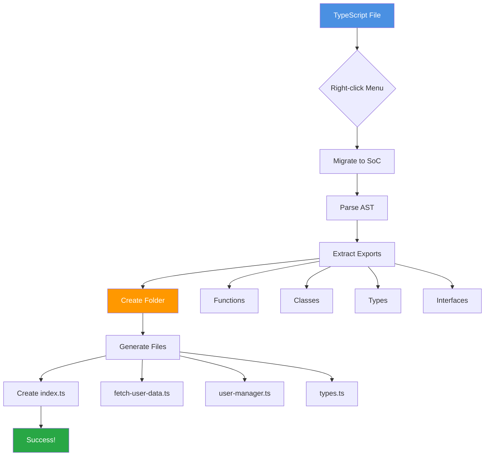

```mermaid
flowchart TD
    A[TypeScript File] --> B{Right-click Menu}
    B --> C[Migrate to SoC]
    C --> D[Parse AST]
    D --> E[Extract Exports]
    E --> F[Create Folder]
    F --> G[Generate Files]
    G --> H[Create index.ts]
    H --> I[Success!]
    
    E --> E1[Functions]
    E --> E2[Classes]  
    E --> E3[Types]
    E --> E4[Interfaces]
    
    G --> G1[fetch-user-data.ts]
    G --> G2[user-manager.ts]
    G --> G3[types.ts]
    
    style A fill:#4A90E2,color:white
    style I fill:#28A745,color:white
    style F fill:#FF9800,color:white
```
